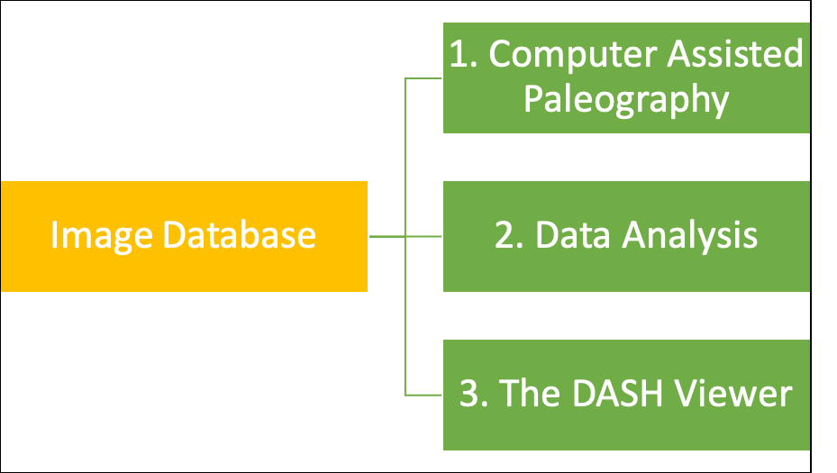

The Digital Analysis of Syriac Handwriting (DASH) project began in 2010 as a collaboration between a professor of religious studies, a professor of computer science, and an engineering major in search of a senior thesis. In recent years, it has expanded to include a professor of visual analytics as an additional principal collaborator, researchers from Duke, UC Davis, Notre Dame, and Belgium as consultants, and over 30 undergraduate and graduate research assistants. The project has received support from the Andrew Mellon Foundation, the American Council of Learned Societies, the American Academy of Religion, Mount Holyoke College, Smith College, and Stanford University.

This digital paleography project uses ancient manuscripts written in the Aramaic dialect of Syriac as a case study for exploring how recent advances in the digital analysis of handwriting can help scholars better ascertain a manuscript's provenance, identify manuscripts written by the same scribe, and trace out the chronological development of ancient scripts. Although the initial project goal is to substantially advance our understanding of Syriac Christianity, its larger effect is providing a platform and a model for similar ventures in other languages such as Arabic, Greek, Hebrew, Latin, and Sanskrit. At present, the project consists of a core image database along with three project trajectories that utilize this data. 

At the project’s center is an **Image Database** that includes almost 200 early, securely dated Syriac manuscripts and just under 120,000 individually identified letter images. Three avenues of research and dissemination build upon this extensive data set: 

1) **Computer Assisted Paleography**: A series of forays have explored the feasibility of using this data to match pages and manuscripts written by the same scribe, as well as to estimate a given manuscript’s composition date. Initial results can be found in articles cited under the “Publications” menu above. 

2) **Data Analysis**: A number of published articles and on-going projects employ project data to better understand the development of Syriac script, Syriac scribes, and Syriac manuscript culture. The “Results” menu above accesses some quick case examples of this research, which can be found in much greater detail among articles published by project team members. 

3) **DASH Viewer**: The on-line manuscript viewer and customizable script chart generator found on this website enable other scholars to use a section of the script database for their own research and can help them better localize the manuscripts that they are studying. As a starting point to help projects in other linguistic traditions, our project’s code can be found on GitHub at [https://github.com/sul-cidr/scriptchart](https://github.com/sul-cidr/scriptchart). 