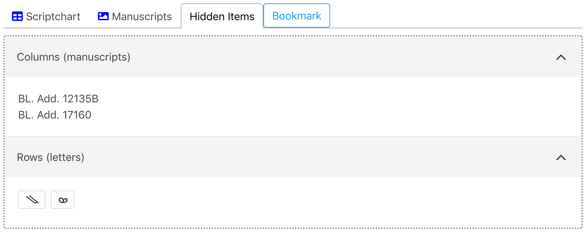
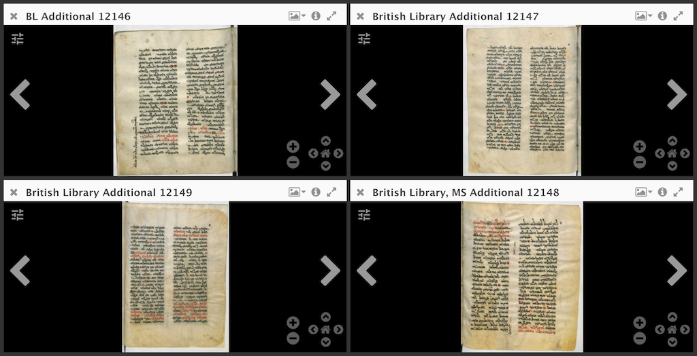

## Form 

Within DASH, the scriptchart and manuscript viewer are controlled by the "Viewer options" form. To select which manuscripts you want to include in the scriptchart or see in the viewer, click each manuscript shelfmark while holding command on Mac (⌘) or control (Ctrl). You can re-order the list of manuscripts by selecting either "Shelfmark" or "Date." Whichever you select will affect the order of the manuscripts in the scriptchart as well. 

To select the letters you wish to see in the scriptchart, click each letter in the "Select letters" grid. Selected letters will be highlighted. After determining which letters to include, you can also determine how many examples of each letter will appear within the chart for each manuscript. 

By default, the scriptchart shows binarized and trimmed images of each letter. You can instead see the original, unaltered letter image by selecting "Untrimmed" in the "Show letter images" option. 

When you hover over a letter image in the scriptchart, a popup will appear that shows the letter within the context of its manuscript page. You can determine how much context by selecting a different "Context size." If you prefer seeing this context popup only when you click the letter image, choose "Show on click."

Anytime you change any of the "Viewer options," make sure to hit "Submit" again so that the scriptchart can process and reflect those changes. 

When working with the scriptchart or the manuscript viewer, you can collape the "Viewer options" to provide more space. Click the arrow in the top right of the "Viewer options" box. To reopen the options, click the arrow again. 

## Scriptchart

Within the scriptchart, letters and manuscripts will appear in a table ordered by the "Viewer options." If you want to reorder the letters or manuscripts, you can drag the columns or rows into whatever order you choose. 

If you no longer want to see all of the letters or manuscripts in the scriptchart, you can hide any row or column by clicking the "X" at the top of the column or to the left of the row. Hidden columns or rows will appear in a list once you click "Hidden Items" in the tab bar at the top of the scriptchart. To return any of these manuscripts or letters to the scriptchart, click the manuscript title or letter. 

In order to view the manuscripts in the Mirador manuscript viewer, click "Manuscripts" in the tab bar. The first four manuscripts loaded into the scriptchart will appear. Within the scriptchart, click the book icon at the top of the manuscript column to load that manuscript into the Mirador viewer. It will replace the last tile of the manuscript viewer. 

