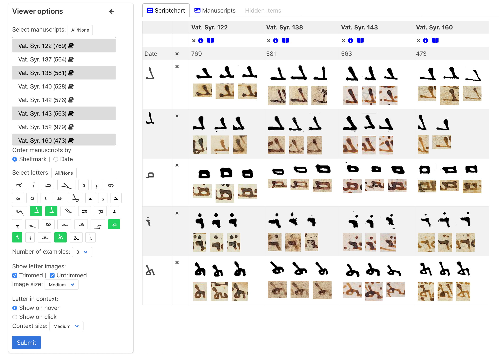
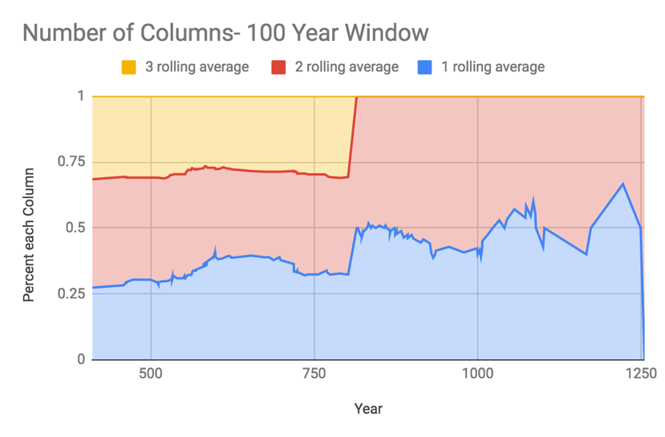
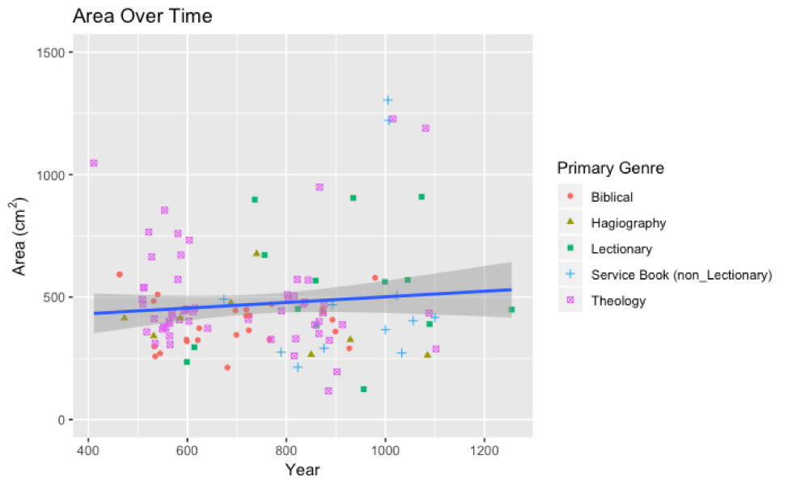

Having the world’s largest database of Syriac letter forms allows one to both describe and quantify important developments in Syriac manuscript culture. In some cases, this helps with computer assisted paleography. That is, automated results provide data that allow human paleographers to better localize Syriac manuscripts. In other cases, project data challenges long held assumptions in the field (e.g. the traditional way of categorizing Syriac script) or opens up new fields of inquiry (e.g. the relationship between script and genre). Although more details appear in project publications, the following provide several quick case examples for how large data sets, digital analysis, and visual analytics can help researchers address key philological and historical problems. 

The hope is that these visuals will spur ideas for your own research projects. If you find DASH helpful for a presentation or publication, please do contact us. We would love to include a citation, link, or abstract of your work on this website. Knowing that you are using DASH will also help us justify future updates and expansions to the project. In addition to the images that are publicly accessible on this website, we have much additional paleographic data that may be helpful to researchers. If you have a project for which you think a larger dataset could be of use, do send us a note using the “contact” menu above.  

### Automatic Script Charts

The project database has over 110,000 individual letter images, each “hand” trimmed and with associated metadata. This enables the instant generation of script charts in accord with user specifications. For example, as shown in the above chart taken from the DASH Viewer, one can trace the relationship of various letter forms to each other over time.

### Scatterplot Indicating Chronological Markedness of Select Syriac Letters

Having access to 96% of early, securely dated Syriac manuscripts allows one to identify the first appearance of various letter forms. These, in turn, can help scholars estimate composition dates for the majority of Syriac manuscripts that do not have a scribal colophon stating when they were written. 

### Parallel Coordinates Plot Illustrating the Use of E and S Forms Among Securely Dated Manuscripts

This chart indicates whether a specific manuscript has an E (Estrangela) form of a given letter (top of chart), an S (Serto) form of a given letter (bottom of chart), or both forms of a given letter (middle of chart). It allows one to quickly detect cases where a manuscript mixes E and S forms of a given letter. Every time a line crosses from top to bottom or bottom to top it represents a scribe using the E form of some letters but the S form of others. These results strongly suggest that the most typical way of classifying Syriac script as either exclusively Estrangela or Serto does not work particularly well for early manuscripts.

### Parallel Coordinates Plot of British Library Manuscripts with an Estimated Composition Date of the Fifth- through Eleventh Century

As with securely dated manuscripts, data from 593 manuscripts that the cataloger William Wright estimated as being written prior to the 1100s also shows the prevalence of mixed-script manuscripts. Every time a line crosses from top to bottom or bottom to top it represents a scribe using the E form of some letters but the S form of others. 

### Correlation Between Script and Genre

This chart compares the prevalence of E and S letter forms in biblical versus non-biblical manuscripts. Although over time scribes of all genres increasingly used S letter forms, the shift from majority E to majority S forms occurs hundreds of years earlier among non-biblical as compared to biblical manuscripts. This strongly suggests that Syriac scribes considered E letter forms as part of a prestige script. Although S letter forms could be written more quickly, when copying biblical materials scribes were more conservative in maintaining Estrangela letter forms.

### Column Number over Time

This chart uses a 100-year window to trace chronologically the prevalence of triple-column, double-column, and single-column securely dated manuscripts. It illustrates the gradual decline in the popularity of triple-column manuscripts.

### The Size of Syriac Codices

This preliminary plot looks at the currently preserved size of early securely dated manuscripts. These first results suggest that there is at most a minor correlation between a manuscript’s size and when it was copied. By comparison, genre appears to play a much greater role in book size.